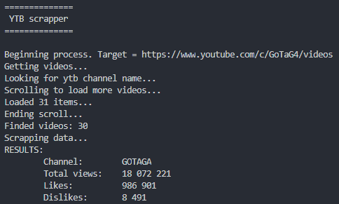

# test-Scrapper
Small repository to try and discover scrapping process. For this projet I use [puppeteer](https://pptr.dev/).

To see what is happening during the process, you can add the option `{ headless: false }` into the browser initialisation :
```javascript
    const browser = await puppeteer.launch({ headless: false });
```

## Summary

- screenshot/
- scrapping_demo/
- personnal_training/
- scrap/

***
## Screenshot

*./screenshot/test_screenshot.js*

First application with puppeteer. Load an url given in parameter and save a screenshot of it. The url must be formatted like *http://www.hostname.com*.

To try it:

`node test_screenshot.js` : will create a screenshot of http://www.google.com

`node test_screenshot.js [url]` : will create a screenshot of the url

***
## Scrapping_demo

*./scrapping_demo/scrape.js*

This program aims to scrap the website [books to scrap](http://books.toscrape.com/). This website has been made in order to test scrapping tools. The program will create a list with all items links and then get their title and price.

To try it:

`node scrape.js`

***
## Personal training

*./ytb/ratio.js*

This program aims to reveal the ratio like/dislike of a given youtube channel. No problem to load url but use a lot your CPU when fetching data. **Unexpected bug !!** Cannot get more than 30 videos and I can't figure out why. Actually looking for a better way to load more videos without using ytb api.

TODO:
- [] group pages
- [] distribute the calculations to lighten the cpu
- [] find a better way to simulate mouse scrolling and get more videos

To try it:

`node ./ratio.js url [--debug]` : `url` must be a link to a youtube channel (home or video tab). `--debug` enable you to see what puppeteer is doing

*Example*:



## scrap

Small script with a with a puppeteer encapsulation test. To run it just write `node scrap/test-scrapper.js` in your terminal. It will create logs and a report (a CSV file) with all products that have been gotten.
